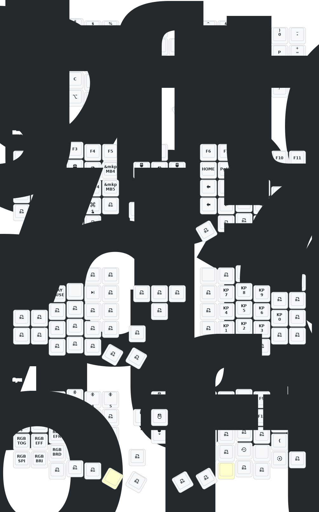

# Eyelash Sofle



# Hardware
Sofle Split Keyboard Bluetooth Dual Mode Zmk Scheme Custom Rgb Hot Swap With View Directional Rocker Knob Screen Keyboard

Model: nice!nano
Board-ID: nRF52840-nicenano (v2?)
SoftDevice: S140 version 6.1.1
Date: Jun 19 2021
- where to buy: https://es.aliexpress.com/item/1005007821701661.html

# How to modify a key
0. Check the tutorial video in this readme
1. Modify the key in this file `boards/arm/eyelash_sofle/eyelash_sofle.keymap`
   - Use https://nickcoutsos.github.io/keymap-editor/ and load your config repo 
2. Create a commit with your changes
3. Download the compiled files in github actions
4. Connect your devices by USB and press the reset button twice
5. Copy the files in the usb folder (left for left, and right for right)

# Tools

- https://nickcoutsos.github.io/keymap-editor/
- https://zmk.studio/download
- https://en.key-test.ru/
- https://keymap-drawer.streamlit.app/
- https://pictogrammers.com/library/mdi/x

To draw the keyboard use this command
```
keymap -c ./keymap_drawer.config.yaml parse -z ./config/eyelash_sofle.keymap > ./keymap-drawer/eyelash_sofle.yaml

keymap -c ./keymap_drawer.config.yaml draw ./keymap-drawer/eyelash_sofle.yaml -j ./config/eyelash_sofle.json > ./keymap-drawer/eyelash_sofle.svg
```

# Resources to practice
- https://docs.splitkb.com/resources
- https://www.edclub.com/sportal/program-3.game
- https://www.keybr.com/
- https://typ.ing/

# Inspiration

- https://github.com/mctechnology17/zmk-config
- https://github.com/urob/zmk-config
- https://github.com/WillJH/ZMKKeyboard
- https://github.com/minusfive/zmk-config/tree/main

# Tutorials

- https://www.youtube.com/watch?v=Kx8F4xI5yno

# Update List

- 2024/12/21
  1. Added support for zmk-studio (just refresh the left hand to use).
- 2024/10/24
  1. Modified power supply mode to reduce power consumption.
  2. Fixed the automatic shut-off feature for RGB power supply.

> Original Repo https://github.com/a741725193/zmk-sofle
> 
---