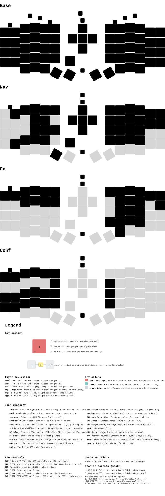

# Eyelash Sofle



# Hardware
Sofle Split Keyboard Bluetooth Dual Mode Zmk Scheme Custom Rgb Hot Swap With View Directional Rocker Knob Screen Keyboard

Model: nice!nano
Board-ID: nRF52840-nicenano (v2?)
SoftDevice: S140 version 6.1.1
Date: Jun 19 2021
- where to buy: https://es.aliexpress.com/item/1005007821701661.html

# How to modify a key
0. Check the tutorial video in this readme
1. Modify the key in this file `boards/arm/eyelash_sofle/eyelash_sofle.keymap`
   - Use https://nickcoutsos.github.io/keymap-editor/ and load your config repo 
2. Create a commit with your changes
3. Download the compiled files in github actions
4. Connect your devices by USB and press the reset button twice
5. Copy the files in the usb folder (left for left, and right for right)

# Tools

- https://nickcoutsos.github.io/keymap-editor/
- https://zmk.studio/download
- https://en.key-test.ru/
- https://keymap-drawer.streamlit.app/
- https://pictogrammers.com/library/mdi/x

To draw the keyboard use this helper script (auto-detects `keymap` or falls back to `uvx`):
```
./keymap_drawer.sh
```

The script also runs [`generate_legend.py`](generate_legend.py), which injects a rich legend at the bottom of the SVG with:
- A **key-anatomy diagram** showing the tap / hold / shifted zones of a single key plus a combo example.
- Color-coded sections for layer navigation, key colors, RGB controls, macOS modifier glyphs, and the Spanish accent macros.
- A full **icon glossary** with actual MDI glyphs referenced via `<use>`.

### Interactive HTML viewer

For the best browsing experience, open [`index.html`](index.html) — it loads the SVG inline and adds:
- **Hover tooltips** that show the tap / hold / shifted bindings (with friendly names for MDI icons) plus a contextual hint for special positions.
- A sticky header with **layer-jump buttons** (Base / Nav / Fn / Conf / Legend).
- A subtle highlight ring on the key or combo under the cursor.

Because `index.html` uses `fetch()` to inline-load the SVG, **you need to serve it from a local HTTP server** (browsers block `fetch()` over `file://`):
```bash
python3 -m http.server 8765
# then open http://localhost:8765/index.html
```

> The standalone SVG also embeds CSS animations (hover on keys, glow on combos, subtle pulse on the red Esc/Caps key, fade-in on load).
> Animations only run when the SVG is opened **directly** in a browser, not when embedded as `` (e.g. inline in this README). To see them, open [keymap-drawer/eyelash_sofle.svg](keymap-drawer/eyelash_sofle.svg) in your browser, or use `index.html`.

### Spanish accents (macOS)

The right pinky keys on the Base layer use plain `&mt` (mod-tap) to arm the macOS dead keys on hold. Typing an accented vowel is a two-step flow:

| Key                | Tap | Hold (one shot)        | Then tap a vowel to compose                   |
|--------------------|-----|------------------------|-----------------------------------------------|
| right pinky home   | `;` | `Option+N` (tilde `~`) | `n` → `ñ`, `a/e/i/o/u` → `ã / ẽ / ĩ / õ / ũ`  |
| right pinky outer  | `'` | `Option+E` (acute `´`) | `a` → `á`, `e` → `é`, `i/o/u` → `í / ó / ú`   |

Bindings in `config/eyelash_sofle.keymap`:

```
&mt LA(N) SEMI     &mt LA(E) APOS
```

This relies on the macOS US keyboard layout (Option+N = tilde dead key, Option+E = acute dead key). On other OSes the hold simply sends `Option+N` / `Option+E` and the dead-key behavior won't apply.

# Resources to practice
- https://agilefingers.com/es/textos/texto-ejemplo
- https://www.edclub.com/sportal/program-3.game
- https://www.keybr.com/
- https://typ.ing/

# Inspiration

- https://github.com/mctechnology17/zmk-config
- https://github.com/urob/zmk-config
- https://github.com/WillJH/ZMKKeyboard
- https://github.com/minusfive/zmk-config/tree/main
- https://josefadamcik.github.io/SofleKeyboard/
- https://github.com/josefadamcik/SofleKeyboard
- https://docs.splitkb.com/resources

# Tutorials

- https://www.youtube.com/watch?v=Kx8F4xI5yno

# Update List

- 2024/12/21
  1. Added support for zmk-studio (just refresh the left hand to use).
- 2024/10/24
  1. Modified power supply mode to reduce power consumption.
  2. Fixed the automatic shut-off feature for RGB power supply.

> Original Repo https://github.com/a741725193/zmk-sofle
> 
---